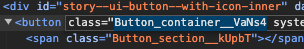
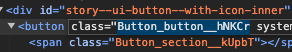
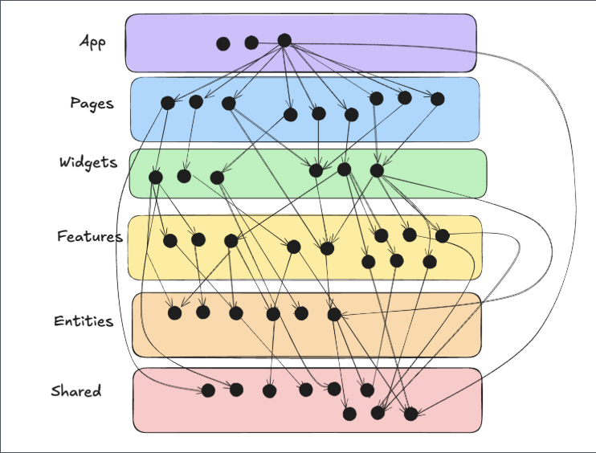
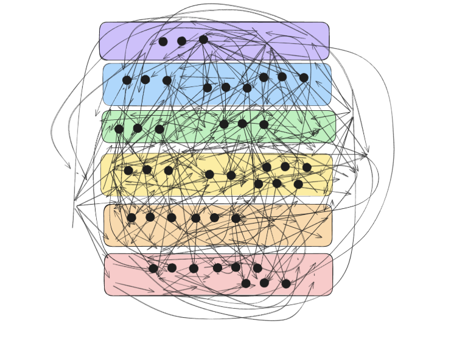
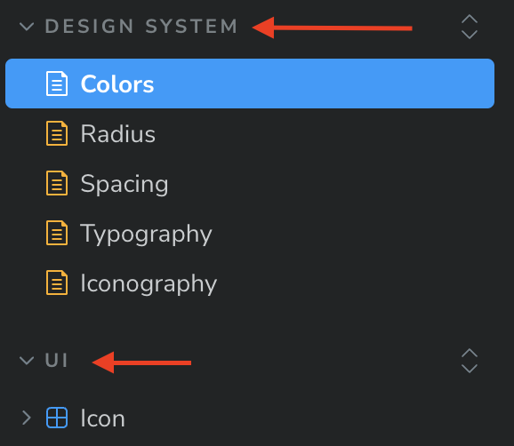

# Регламент frontend разработки

## <span style="color:darkorange;">Предисловие</span>

В этом разделе базы знаний вы найдете необходимые регламенты по frontend разработке. Если у вас возникнут вопросы, обращайтесь к своему лиду или автору статьи.

Если вы заметите несоответствие между регламентом и кодом проекта, комментариями во время ревью или словами одного из разработчиков, обязательно сошлитесь на статью. Возможно, какая-то из статей устарела и её необходимо обновить, или кто-то из разработчиков использует устаревшую или неверную информацию.

## <span style="color:darkgreen;">Цель регламента</span>

Цель данного регламента — установить ясные и однозначные правила для наименования элементов кода, чтобы улучшить читаемость, поддержку и совместную работу в проекте. Он направлен на создание осмысленных, самодокументированных и структурированных названий, которые способствуют избеганию путаницы и облегчению понимания кода.

## <span style="color:darkorange;">Ясность и самодокументированность</span>

- <span style="color:darkgreen;">**Название должно быть осмысленным.**</span> Имя константы/компонента/метода/типа и т.д. должно чётко указывать, что именно они представляют.
  Например, вместо `MAX` лучше использовать `MAX_CONNECTIONS`.
- <span style="color:darkgreen;">**Не используйте аббревиатуры без необходимости.**</span> Например, `DATA_BASE_TIMEOUT` предпочтительнее, чем `DB_TIMEOUT`, а уж тем более предпочтительнее чем `DBTO`.

---

## <span style="color:darkorange;">Следуйте соглашениям</span>

- <span style="color:darkgreen;">**UPPER_SNAKE_CASE для констант.**</span> UPPER*SNAKE_CASE представляет собой стиль написания составных слов или фраз, в котором все слова пишутся в верхнем регистре и разделяются нижними подчеркиваниями `*`.
Примеры: `DEFAULT_TIMEOUT`, `PI`.

  Так же это правило распространяется на ключи в enum-ах.
  Примеры:

  ```typescript
  export enum ELanguage {
    EN = 'en',
    RU = 'ru',
  }
  ```

  ```typescript
  export enum ESortDirection {
    ASC = 'ASC',
    DESC = 'DESC',
  }
  ```

  ```typescript
  export enum EAppRoute {
     CHANNELS = '/channels',
     SERVICE_CATALOG = '/service/catalog',
     SERVICE_CATALOG_INFO = '/service/catalog/[uid]/info',
     SERVICE_CATALOG_STATISTICS = '/service/catalog/[uid]/statistics',
    ...
  }
  ```

- <span style="color:darkgreen;">**PascalCase для компонентов и типизации**</span>. PascalCase представляет собой стиль написания составных слов или фраз, в котором каждое слово начинается с заглавной буквы, без пробелов и разделителей.
  Примеры: `SearchQueryInput`, `TUser`, `ComponentProps`.
- <span style="color:darkgreen;">**Префиксы/Постфиксы для типизации.**</span> Для именования enum-ов используется префикс `E`, для типов префикс `T`, для интерфейсов префикс `I` (исключениями являются интерфейсы описывающие пропсы компонентов, для них используется постфикс `Props`).
  Примеры: `ELanguage`, `TLanguage`, `ILanguage`, `ButtonProps`.
- <span style="color:darkgreen;">**camelCase для функций, методов, переменных, хуков и стилей.**</span> camelCase представляет собой стиль написания составных слов или фраз, в котором первое слово начинается с маленькой буквы, а последующие — с заглавной, без пробелов и разделителей.
  Примеры: `getLanguagesList`, `useSortableTable`, `handleCheckboxChange`, `selectedItems`, `loaderContainer`.
- <span style="color:darkgreen;">**kebab-case для стилей зависимых от входных параметров компонента.**</span> kebab-case представляет собой стиль написания составных слов или фраз, в котором все слова пишутся с маленькой буквы и разделяются дефисами. Пример:

  ```css
  .variant-primary {
     ...
  }
  .variant-secondary {
     ...
  }
  .size-100 {
     ...
  }

  .size-200 {
     ...
  }

  ```

  Такой подход позволяет повысить читаемость применяемых стилей внутри компонента

  ```typescript
  const variantStyle = styles[`variant-${variant}`];
  const sizeStyle = styles[`size-${size}`];
  ```

---

## <span style="color:darkorange;">Используйте категории или контексты</span>

Названия, которые относятся к определённому контексту, желательно обозначать как часть этого контекста. Примеры:

- Вместо `LINK_MAX_LENGTH` лучше использовать `CHANNEL_LINK_MAX_LENGTH`
- Вместо `SortFilter` лучше использовать `ProjectsSortFilter`
- Вместо `useData` лучше использовать `useApplicationsData`
- Вместо `TGetListResponse` лучше использовать `TGetThemesListResponse` и т.д.

Это помогает избежать конфликта имён и даёт понимание, как связаны значения констант.

---

## <span style="color:darkorange;">Не завязывайтесь на конкретных значениях</span>

Константа должна отражать смысл, а не её текущее значение. Примеры:

- Вместо `SECONDS_60 = 60` лучше использовать `DEFAULT_SESSION_TIMEOUT = 60`
- Вместо `--system-color-red-400: #e85555` лучше использовать `--system-color-danger-400: #e85555`
- Вместо `--system-radius-24: 24px` лучше использовать `--system-radius-large: 24px` или `--system-radius-500: 24px`, как в нашем проекте.

Значение может измениться, но смысл останется прежним.

---

## <span style="color:darkorange;">Уточняйте единицы измерения</span>

Если константа связана с числовым значением, важно уточнять единицы. Примеры:

- Вместо `MAX_FILE_SIZE = 100` лучше использовать `MAX_FILE_SIZE_MB = 100`
- Вместо `ERROR_DISPLAY_TIME = 5000` лучше использовать `ERROR_DISPLAY_TIME_MS = 5000`

---

## <span style="color:darkorange;">Избегайте "магических чисел"</span>

Если в коде появляется число или строка, которые имеют смысл только в контексте, лучше использовать для них константы. Пример:

```typescript
# Плохо
if (retries > 3) {
   ...
}
```

```ts
# Хорошо
const MAX_RETRIES = 3;
if (retries > MAX_RETRIES) {
   ...
}
```

---

## <span style="color:darkgreen;">Цель регламента</span>

Цель данного регламента — установить единые правила для стиля кода, которые помогут обеспечить чистоту, консистентность и удобство работы с кодом в команде.

---

## <span style="color:darkorange;">Import/Export</span>

### <span style="color:darkgreen;">Старайтесь избегать дублирования в путях import и export</span>

✅ Хорошо:

```ts
import { Pagination } from '../Pagination';
```

❌ Плохо:

```ts
import { Pagination } from '../Pagination/Pagination';
```

Для решения этой проблемы используйте `index.ts` файлы для промежуточных экспортов.

Пример:

```ts
export { Pagination } from './Pagination';
```

## <span style="color:darkorange;">Комментарии и документация</span>

### <span style="color:darkgreen;">Все комментарии и документации внутри самой кодовой базы проекта пишутся строго на английском языке</span>

### <span style="color:darkorange;">Тестирование</span>

### <span style="color:darkgreen;">Именуйте автотесты по следующему паттерну</span>

```ts
test('<Функционал>. <Описание тестируемого кейса>', () => {
   ...
});
```

Пример:

```ts
test('Icon UI. Render with invalid name', () => {
 const { container } = render(<Icon name={'InvalidName' as keyof typeof Icons} />);
 expect(container.firstChild).toBeNull();
});
```

## <span style="color:darkorange;">Стилизация</span>

### <span style="color:darkgreen;">При импорте CSS модулей именуйте их </span><span style="color:darkgreen;">`styles`</span>

```ts
import styles from './Button.module.css';
```

### <span style="color:darkgreen;">Старайтесь избегать дублирования в неймингах стилей при использовании CSS Модулей</span>

Настройка CSS Модулей автоматически подставляет префикс с названием компонента, нам нужно стремиться к тому, чтобы минимизировать упоминание названия компонента внутри `module.css` файла.

✅ Хорошо:

```css
/* Button.module.css */
.container {
  ...
}
```

❌ Плохо:

```css
/* Button.module.css */
.button {
  ...
}
```

**Результат**

✅ Хорошо:



❌ Плохо:



## <span style="color:darkorange;">Иконки</span>

<span style="color:darkgreen;"></span><span style="color:darkorange;">TODO:</span><span style="color:darkorange;"> </span>**Актуально только для проекта N, возможно стоит распространить подход с этим компонентом на все проекты, либо избавиться от этого правила.**

### <span style="color:darkgreen;">~~Для отрисовки иконок используйте компонент~~ </span><span style="color:darkgreen;">`~~Icon~~`</span>

<span style="color:darkorange;">~~Ссылка на документацию компонента Icon в Storybook:~~</span> [~~UI/Icon~~]()<span style="color:dimgray;"></span>

<span style="color:darkorange;">~~Ссылка на текущий список иконок проекта в Storybook:~~</span> [~~Design system/Iconography~~]()<span style="color:dimgray;"></span>

<span style="color:dimgray;"></span>

## <span style="color:darkorange;">Early return</span>

### <span style="color:darkgreen;">Используйте early return(ранний выход) где имеется такая возможность</span>

Пример:

✅ Хорошо:

```ts
const handlePrevPage = useCallback(() => {
  if (!(value > 1)) return;
  onChange(value - 1);
}, [value, onChange]);
```

❌ Плохо:

```ts
const handlePrevPage = useCallback(() => {
  if (value > 1) {
    onChange(value - 1);
  }
}, [value, onChange]);
```

Таким образом мы уменьшаем вложенность и повышаем читаемость кода.

## <span style="color:darkgreen;">Цель регламента</span>

Цель данного регламента — установить структуру и принципы для организации фронтенд-кода с помощью методологии Feature Sliced Design (FSD), обеспечивая разделение функционала на независимые модули, инкапсуляцию логики и данных, и правильное управление зависимостями между модулями. Регламент направлен на создание чистой и гибкой архитектуры проекта, упрощение его поддержки и расширения.

---

## <span style="color:darkorange;">Основные принципы</span>

**Feature Sliced Design (FSD)** представляет собой методологию, направленную на организацию фронтенд-кода путем разделения функционала на независимые модули.

Подробнее можно ознакомиться в документации, поддерживает русский язык, что приятно. <https://feature-sliced.design/ru/>

Основные принципы FSD включают:

- **Функциональное разделение**\: модули и компоненты должны быть разделены на слои (entities, features, shared, pages и т.д.) в зависимости от их роли и ответственности.
- **Инкапсуляция**\: каждый модуль должен содержать только ту логику и данные, которые относятся к его области ответственности.
- **Иерархия зависимостей**\: модули верхнего уровня могут зависеть от модулей нижнего уровня, но не наоборот.

## <span style="color:darkorange;">Понятия</span>

<span style="color:darkgreen;">**Слои**</span><span style="color:darkgreen;"> </span> – это директории верхнего уровня, такие как `app`, `pages`, `widgets`, `features`, `entities`, `shared`.

<span style="color:darkgreen;">**Слайсы**</span><span style="color:darkgreen;"> </span> – это директории, представляющие предметную область, которые располагаются внутри слоев (за исключением `app` и `shared`). Каждый слайс описывает конкретный процесс или сущность. Примеры: `manager`, `user-authorization-form`, `product-list`.

<span style="color:darkgreen;">**Сегменты**</span><span style="color:darkgreen;"> </span> – это директории, организующие код по его назначению. Они находятся внутри слайсов, а также в слоях `app` и `shared`. Примеры сегментов: `ui`, `api`, `lib`, `model`, `config`. Нейминг сегментов не является строгим и может быть адаптирован под нужды вашего проекта.

Подробнее можно ознакомиться в документации в разделе "Обзор". <https://feature-sliced.design/ru/docs/get-started/overview>

## <span style="color:darkorange;">Структура проекта</span>

<span style="color:darkorange;">ВАЖНО!!</span> Мы используем методологию проектирования Feature Sliced Design (FSD), согласно которой компоненты страниц должны размещаться в соответствующем слое `/page`. Однако в Next.js папка `/page` зарезервирована для построения роутинга. Несмотря на то что мы применяем рекомендованный в Next.js с версии 13 app роутинг, фреймворк по-прежнему не позволяет нам использовать папку `/page` и выдаёт ошибку о конфликте. Поэтому в данном случае мы отклоняемся от методологии FSD и инициализируем компоненты страниц непосредственно в их директориях роутинга.

**Пример:**

```
app/
└── channels/
    ├── page.tsx
    ├── ChannelsPage.tsx
    └── ChannelsPage.module.css
```

Проект должен быть организован по слоям, каждый из которых отвечает за конкретную задачу

```
src/
├── app/                // Роутинг, компоненты страниц, инициализация приложения, глобальные стили и провайдеры
├── shared/             // Переиспользуемые ресурсы (UI-компоненты, утилиты, библиотеки)
│   ├── api/            // Обертки для работы с API
│   ├── config/         // Конфигурации приложения
│   ├── constants/      // Константы
│   ├── lib/            // Утилиты и вспомогательные функции
│   └── ui/             // Переиспользуемые UI-компоненты
├── entities/           // Бизнес-сущности (например, User, Product)
│   ├── user/
│   └── product/
├── features/           // Фичи (функциональные модули)
│   ├── authentication/
│   └── shopping-cart/
└── widgets/            // Виджеты (композиции фич и сущностей)
    ├── header/
    └── footer/
```

## <span style="color:darkorange;">Слои и их ответственность</span>

1. **App** `src/app/`\:
   - Роутинг
   - Инициализация приложения.
   - Глобальные стили и провайдеры.
   - Конфигурация роутера Next.js.
2. **Pages** `src/pages/`\:
   - Страницы приложения.
   - Логика маршрутизации и рендеринга страниц.
3. **Widgets** `src/widgets/`\:
   - Композиционные блоки, объединяющие фичи и сущности.
   - Виджеты могут включать в себя сложные UI-компоненты, собирающие несколько фич и сущностей.
4. **Features** `src/features/`\:
   - Реализация функциональных модулей приложения.
   - Каждая фича изолирована и может включать в себя UI-компоненты, бизнес-логику, API-вызовы и состояния.
5. **Entities** `src/entities/`\:
   - Определение бизнес-сущностей.
   - Сущности содержат модели, логику и компоненты, относящиеся к конкретным сущностям.
6. **Shared** `src/shared/`\:
   - `api/`\: Обертки и модули для работы с API.
   - `config/`\: Конфигурационные файлы и настройки.
   - `constants/`\: Константы, используемые в приложении.
   - `lib/`\: Утилиты и вспомогательные функции.
   - `ui/`\: Переиспользуемые UI-компоненты.

## <span style="color:darkorange;">Основные правила</span>

<span style="color:darkgreen;">**Сохраняйте однонаправленность**</span>

Модули на одном слое могут использовать только модули находящиеся на слоях строго ниже.

В таблице ниже приведен список доступностей

| Слой       | Он может использовать                            | Его могут использовать                        |
| ---------- | ------------------------------------------------ | --------------------------------------------- |
| `app`      | `pages` `widgets` `features` `entities` `shared` | \-                                            |
| `pages`    | `widgets` `features` `entities` `shared`         | `app`                                         |
| `widgets`  | `features` `entities` `shared`                   | `app` `pages`                                 |
| `features` | `entities` `shared`                              | `app` `pages` `widgets`                       |
| `entities` | `shared`                                         | `app` `pages` `widgets` `features`            |
| `shared`   | \-                                               | `app` `pages` `widgets` `features` `entities` |

<span style="color:darkgreen;">**Избегайте сцепленности между слайсам на одном уровне**</span>

Слайсы на одном слое не могут использовать друг друга, то есть widget не может использовать widget, фича не может использовать фичу. Обратите внимание что это правило не касается слоев app и shared, т.к. внутри них не используются слайсы.

<span style="color:darkgreen;">**Используйет Public API правильно**</span>

<span style="color:darkgreen;"></span>Хороший публичный API делает использование и интеграцию слайса в другой код удобным и надежным. Этого можно достичь, поставив три цели:

1. Остальная часть приложения должна быть защищена от структурных изменений в слайсе, таких как рефакторинг.
2. Значительные изменения в поведении слайса, которые нарушают предыдущие ожидания, должны вызывать изменения в публичном API.
3. Только необходимые части слайса должны быть доступны.

Последняя цель имеет важные практические последствия. Может возникнуть соблазн создать слепые реэкспорты всего, особенно на ранних этапах разработки слайса, потому что любые новые объекты, которые вы экспортируете из своих файлов, также автоматически экспортируются из слайса:

❌ Плохо:

**features/comments/index.js**

```ts
export * from './ui/Comment'; // 👎 не пытайтесь повторить дома
export * from './model/comments'; // 💩 это плохая практика
```

Это ухудшает понимаемость слайса беглым взглядом, потому что вы не можете легко определить, каков интерфейс этого слайса. Не зная интерфейс, вам придется глубоко погружаться в код слайса, чтобы понять, как его интегрировать. Еще одна проблема заключается в том, что вы можете случайно раскрыть внутренние модули, что усложнит рефакторинг, если кто-то начнет от них зависеть.

Подробнее можно ознакомиться в документации в разделе "Public API". <https://feature-sliced.design/ru/docs/reference/public-api>

<span style="color:darkgreen;">**Итог**</span>

Эти правила составляют основной костяк методологии Feature Sliced Design и позволяют нам создавать простую и понятную структуру проекта. Риски ошибок при изменениях сильно снижаются и проект проще масштабировать.

✅ Хорошо:



❌ Плохо:



Подробнее можно прочитать про

## Как определить, к какому слою относится модуль?

В первую очередь важно понять, что Feature-Sliced Design — это методология, которая строиться на бизнес ценностях программного продукта. Поэтому и смотреть на слайсы вы должны с точки зрения бизнеса в первую очередь, а не ограничиваться только технической точкой зрения инженера.

## <span style="color:darkorange;">Принципы организации кода</span>

- **DRY (Don't Repeat Yourself):** Избегайте дублирования кода, выносите повторяющиеся части в shared слой.
- **SOLID:** Принципы объектно-ориентированного проектирования должны применяться для улучшения структуры и гибкости кода.
- **Чистая архитектура:** Код должен быть написан так, чтобы его было легко читать и поддерживать.

## <span style="color:darkorange;">Naming Convention (Именование)</span>

- `kebab-case`\:
  - Папки (исключение папки React-компонентов компонентов)
  - app роутинг Next.js
- `camelCase`\:
  - Файлы функции/методов
  - Файлы кастомных хуков
  - Файлы HOC-ов
- `PascalCase`\:
  - Файлы React-компонентов
  - Папки React-компонентов
  - Файлы Storybook документации

## <span style="color:darkorange;">Примеры организации фич и сущностей</span>

**Feature: Authentication**

```
src/features/authentication/
├── model/
│   ├── useAuth.ts      // Логика аутентификации (хуки, сторы)
│   └── types.ts        // Типы данных
├── ui/
│   ├── LoginForm.tsx   // Компонент формы логина
│   └── SignupForm.tsx  // Компонент формы регистрации
├── api/
│   └── authApi.ts      // API вызовы для аутентификации
└── index.ts            // Экспорт всего необходимого для использования фичи
```

**Entity: User**

```
src/entities/user/
├── model/
│   ├── userModel.ts    // Модель пользователя
│   └── userTypes.ts    // Типы данных пользователя
├── ui/
│   ├── UserProfile.tsx // Компонент профиля пользователя
│   └── UserCard.tsx    // Компонент карточки пользователя
└── index.ts            // Экспорт всего необходимого для использования сущности
```

## <span style="color:darkorange;"></span><span style="color:darkgreen;">Цель регламента</span>

Цель данного регламента — установить стандарты для использования CSS переменных и классов, чтобы обеспечить единообразие, гибкость и централизованное управление стилями в проекте. Регламент предлагает четкие правила именования и градации для цветов, типографики, закруглений и отступов, что упрощает их изменение и рефакторинг, поддерживает согласованность дизайна и экономит ресурсы при обновлениях.

---

### <span style="color:darkgreen;">Для стилизации отступов, цветов, текстов и закруглений используйте глобальные CSS переменные</span><span style="color:darkgreen;">.</span>

<span style="color:darkorange;">Важно!!!</span> Соответствующий данным регламентам Storybook имеется только на проекте N, поэтому ссылки выступают исключительно как примеры. Однако это не самим регламентам быть актуальными для других проектов.

<span style="color:darkorange;">Ссылка на цветовую палитру в Storybook:</span> [Design system/Colors]() <span style="color:dimgray;"></span>

<span style="color:darkorange;">Ссылка на закругления в Storybook:</span> [Design system/Radius]() <span style="color:dimgray;"></span>

<span style="color:darkorange;">Ссылка на отступы в Storybook:</span> [Design system/Spacing]() <span style="color:dimgray;"></span>

<span style="color:darkorange;">Ссылка на типографию в Storybook:</span> [Design system/Typography]() <span style="color:dimgray;"></span>

<span style="color:darkorange;">Ссылка на Storybook:</span> <span style="color:dimgray;"></span>

## <span style="color:darkgreen;">Цель регламента</span>

<span style="color:darkgreen;"> </span>Цель этой статьи регламента — установить правила и рекомендации для документирования компонентов проекта в Storybook, включая правильное размещение и организацию файлов документации.

---

## <span style="color:darkorange;">Зачем?</span>

В первую очередь, <span style="color:red;">Storybook</span> используется в проекте для обеспечения прозрачности составных компонентов пользовательской части проекта (frontend) как для разработчиков, так и для сторонних наблюдателей. Это позволяет разработчикам лучше понимать, из каких элементов можно собрать ту или иную функциональность проекта и из чего состоят уже существующие, а сторонним наблюдателям наглядно видеть процесс разработки и поддержки этих компонентов.

## <span style="color:darkorange;">Прицнип</span>

Абсолютно все составные части проекта, которые определяют функциональность и внешний вид любого модуля проекта, такие как <span style="color:dodgerblue;">CSS переменные</span> и <span style="color:dodgerblue;">UI-кит</span>, должны быть задокументированы в <span style="color:red;">Storybook</span> в том или ином читабельном и интуитивно понятном виде.

## <span style="color:darkorange;">Папки</span>

При документировании проекта через <span style="color:red;">Storybook</span> используйте соответствующие папки, такие как <span style="color:dodgerblue;">Design System</span> и <span style="color:dodgerblue;">UI</span>, не оставляйте страницу документации в свободном плавании.



## <span style="color:darkorange;">Директории файлов документации</span><span style="color:darkorange;"></span>

Располагайте `stories.tsx` и `MDX` файлы рядом с документируемым модулем.

Если это файл с CSS переменными `colors.css` то прямо рядом с ним `MDX` файл с именованием через PascalCase `Colors.mdx`\:

```
.../
├── colors.css
└── Colors.mdx
```

Если это файл с tsx компонент, то создайте внутри его директории папку docs и занесите туда необходимые `stories.tsx` или `MDX` файлы:

```
.../
├── docs/
│   ├── Icon.stories.tsx
│   └── Iconography.mdx
└── Icon.tsx
```

<span style="color:darkorange;"></span><span style="color:darkorange;">Ссылка на GitLab:</span>

## <span style="color:darkgreen;">Цель регламента</span>

Этот регламент позволяет упорядочить процесс разработки и выпуска программного обеспечения в среде Git и GitLab, обеспечивая стабильность и прозрачность всех этапов работы.

---

## <span style="color:darkorange;">Основные ветки</span>

<span style="color:darkgreen;">**master**</span>: Основная ветка, в которой всегда находится стабильный код, готовый для продакшена.

<span style="color:darkgreen;">**develop**</span>: Ветка для интеграции всех фич и изменений, которые проходят тестирование перед релизом. В ней может быть нестабильный код, но он должен быть рабочим.

## <span style="color:darkorange;">Naming</span>

Ветки, commit-ы, релизы, Merge Request-ы и описания к ним пишутся строго на английском языке, без исключений.

---

## <span style="color:darkorange;">Ветвление</span>

### <span style="color:darkgreen;">Feature branches (ветки фич)</span>

Используются для разработки новых фич или для внесения глобальных изменений в логику.

**Название**\: `feature/номер-задачи/название-фичи`

**Создание**\: от `develop`

**Мерж**\: в `develop`

**Формат commit-а:** `[номер-задачи] Feature. <блок где происходили нововведения>. <Описание нововведения>`

### <span style="color:darkgreen;">Bugfix branches (ветки багфиксов)</span>

Используются для исправления багов в `develop` или `release` ветке. Если создается от `develop`, то мержатся в `develop`. Если создается от `release`, то мержатся в `release` (и в `develop`, если это необходимо).

**Название**\: `bugfix/номер-задачи/название-исправления`

**Создание**\: от `develop/release`

**Мерж**\: в `develop/release`

**Формат commit-а:** `[номер-задачи] Bugfix. <блок где происходили исправления>. <Описание исправления>`

### <span style="color:darkgreen;">Release branches (ветки релиза)</span>

Создаются для подготовки нового релиза. В этой ветке проводится финальное тестирование и исправление багов перед мержем в `master`.

**Название**\: `release/номер-релиза`

**Создание**\: от `develop`

**Мерж**\: в `master` и `develop` (чтобы все исправления были в обеих ветках)

### <span style="color:darkgreen;">Hotfix branches (ветки хотфиксов)</span>

Используются для срочного исправления багов в продакшене. Создаются от `master` и мержатся обратно в `master` и `develop` (и в релизную ветку, если она существует).

**Название**\: `hotfix/номер-задачи(опционально)/название-исправления`

**Создание**\: от `master`

**Мерж**\: в `master` и `develop`

**Формат commit-а:** `[номер-задачи(опционально)] Hotfix. <блок где происходили исправления>. <Описание исправления>`

---

## <span style="color:darkorange;"></span><span style="color:darkorange;"></span><span style="color:darkorange;">Работа с Label</span>

**Label** (метки) используются для категоризации и управления Merge Request-ами. Основные типы меток включают:

- **Тип задачи**\: `feature`, `bugfix`, `hotfix`, `release`
- **Приоритет**\: `high`, `medium`, `low`
- **Ответственный**\: `alex`, `oliver`, `john`

При создании Merge Request-а обязательно заполните поле <span style="background-color:gainsboro;">Labels</span> и укажите там тип вашей задачи, её приоритет и исполнителя.

---

## <span style="color:darkorange;">Работа с Release </span><span style="color:dodgerblue;">for Team/Tech Lead</span> <span style="color:dimgray;">DRAFT</span>

**Release** (релизы) создаются на основе веток `release` и представляют собой официальные выпуски продукта. Каждая версия релиза должна содержать:

- **Версия**\: Номер версии релиза
- **Описание**\: Описание изменений, включенных в релиз
- **Дата выпуска**\: Дата, когда релиз был создан
- **Связанные задачи и ветки**\: Список задач и веток, включенных в релиз

---

## <span style="color:darkorange;">Работа с Draft </span><span style="color:dodgerblue;"></span>

Если ваш Merge Request готов к Code Review, выводите его из статуса Draft.

Если ваш Merge Request еще не готов к Code Review, переводите его в статус Draft.

---

## <span style="color:darkorange;">Обработка ошибок</span>

### <span style="color:darkgreen;">Общие принципы</span>

- Не допускайте "тихих" ошибок — всегда логируйте или обрабатывайте их.
- Ошибки должны быть понятны пользователю и разработчику: используйте user-friendly сообщения и подробные технические логи.
- Избегайте обработки ошибок в нескольких местах для одного и того же сценария — централизуйте обработку.

### <span style="color:darkgreen;">Frontend</span>

#### ✅ Хорошо

```ts
try {
  await login(credentials);
  navigate('/dashboard');
} catch (error) {
  showToast('Login failed. Please check your credentials.');
  console.error('Login error', error);
}
```

#### ❌ Плохо

```ts
await login(credentials); // Ошибка проигнорирована
```

### <span style="color:darkgreen;">Обработка HTTP-ошибок</span>

- Создавайте обертку для API-клиента (например, через axios instance), которая будет:

  - перехватывать ошибки (через интерсепторы)
  - пробрасывать `HttpError` с кодом и сообщением
  - автоматически обрабатывать 401/403 (редирект на login)

```ts
axios.interceptors.response.use(
  (response) => response,
  (error) => {
    const { status } = error.response;

    if (status === 401) redirectToLogin();
    if (status >= 500) logToSentry(error);

    return Promise.reject(new HttpError(status, error.message));
  },
);
```

### <span style="color:darkgreen;">Error Boundaries</span>

- Используйте `ErrorBoundary` для защиты UI от краша при неожиданных исключениях в рендере.

```tsx
<ErrorBoundary fallback={<FallbackUI />}>
  <MainPage />
</ErrorBoundary>
```

---

## <span style="color:darkorange;">Асинхронность и Side Effects</span>

### <span style="color:darkgreen;">Принципы</span>

- Все side effects (запросы, подписки, таймеры) размещаются в `useEffect`, `useLayoutEffect` или кастомных хуках.
- Минимизируйте количество эффектов в одном компоненте.
- Старайтесь не использовать `useEffect` как "инициализатор" сложной логики — выносите её в отдельные модули/хуки.

### <span style="color:darkgreen;">Структура useEffect</span>

✅ Хорошо:

```ts
useEffect(() => {
  let isMounted = true;

  fetchData().then((data) => {
    if (isMounted) {
      setData(data);
    }
  });

  return () => {
    isMounted = false;
  };
}, []);
```

или

```ts
useEffect(() => {
  const controller = new AbortController();

  fetch('/api/data', { signal: controller.signal })
    .then((res) => res.json())
    .then(setData)
    .catch((err) => {
      if (err.name !== 'AbortError') {
        console.error(err);
      }
    });

  return () => {
    controller.abort();
  };
}, []);
```

❌ Плохо:

```ts
useEffect(() => {
  fetchData().then(setData); // без защиты от размонтирования
}, []);
```

Все это при условии, что мы не используем стейт-менеджеры / data-fetching библиотеки (например, React Query, SWR, zustand, valtio и т.д.), которые сами решают эту проблему.

### <span style="color:darkgreen;">Async-хуки</span>

Используйте кастомные хуки для повторно используемой логики:

```ts
export const useUserData = (userId: string) => {
  const [data, setData] = useState<User | null>(null);
  const [loading, setLoading] = useState(true);

  useEffect(() => {
    setLoading(true);
    getUser(userId)
      .then(setData)
      .finally(() => setLoading(false));
  }, [userId]);

  return { data, loading };
};
```

### <span style="color:darkgreen;">Отмена запросов</span>

Используйте `AbortController` или защиту от размонтирования в асинхронных эффектов:

```ts
useEffect(() => {
  const controller = new AbortController();

  fetch(`/api/data`, { signal: controller.signal }).then(...);

  return () => controller.abort();
}, []);
```

---
